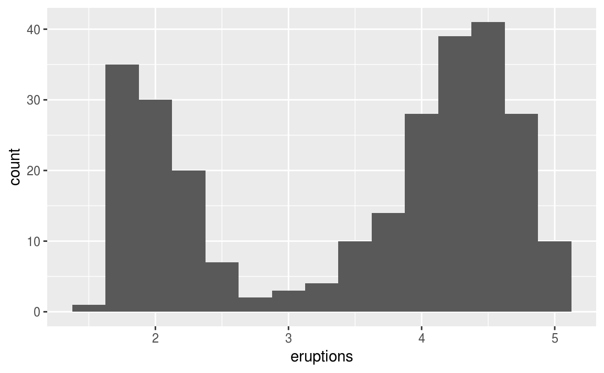
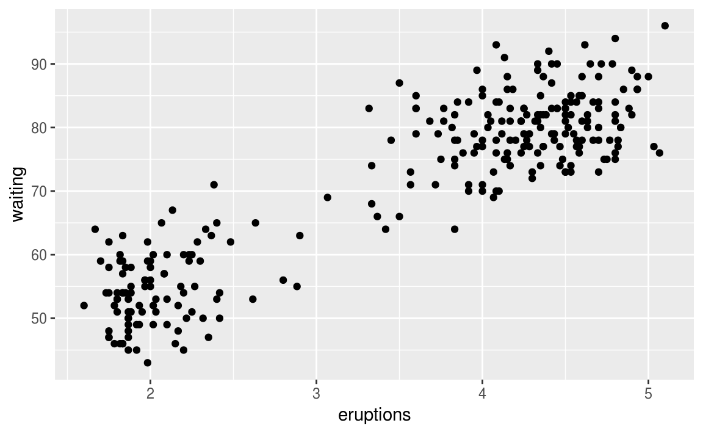
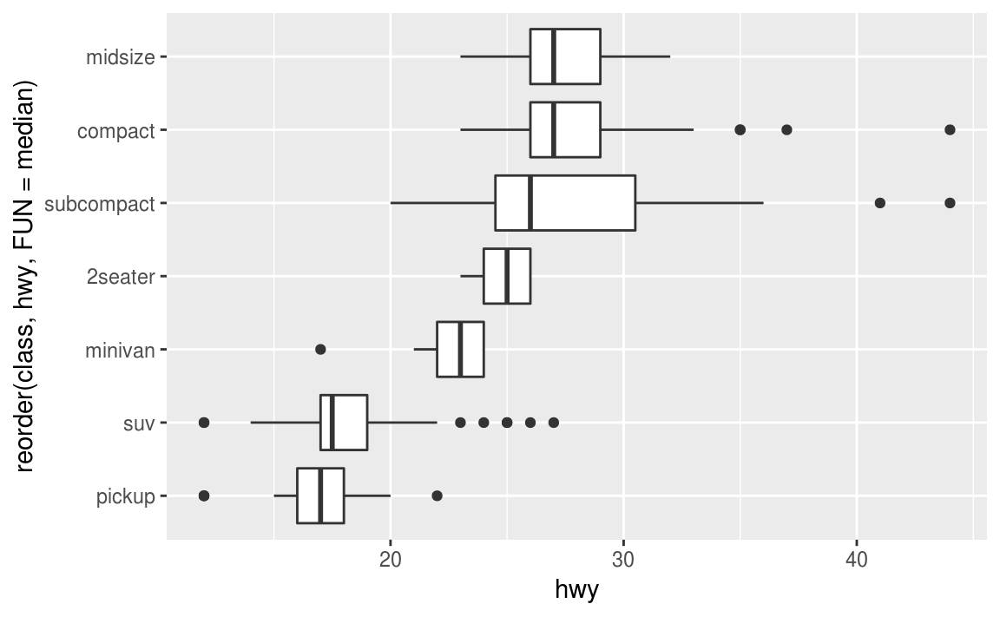
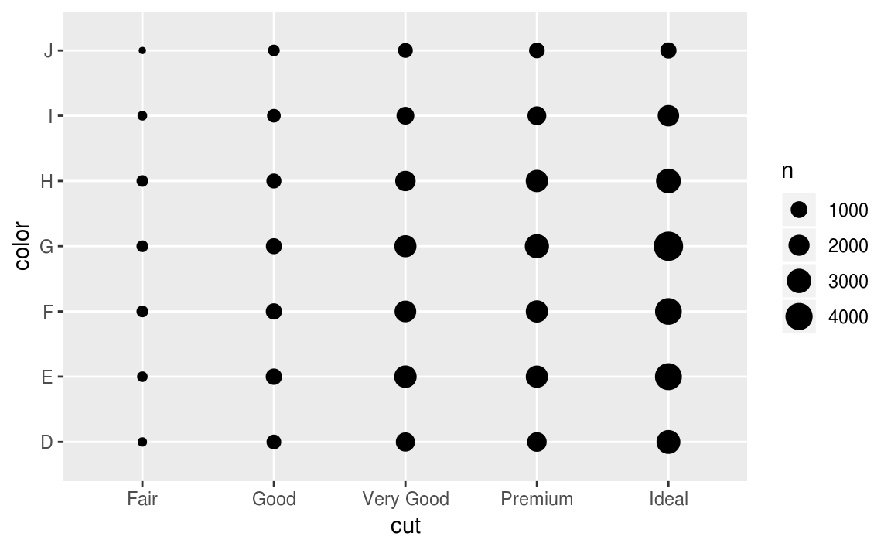
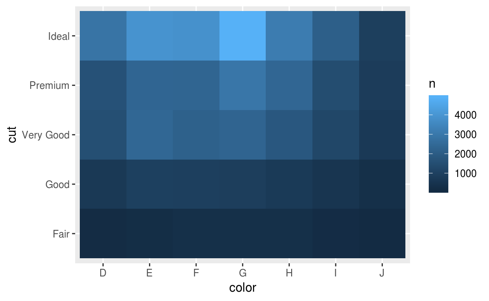
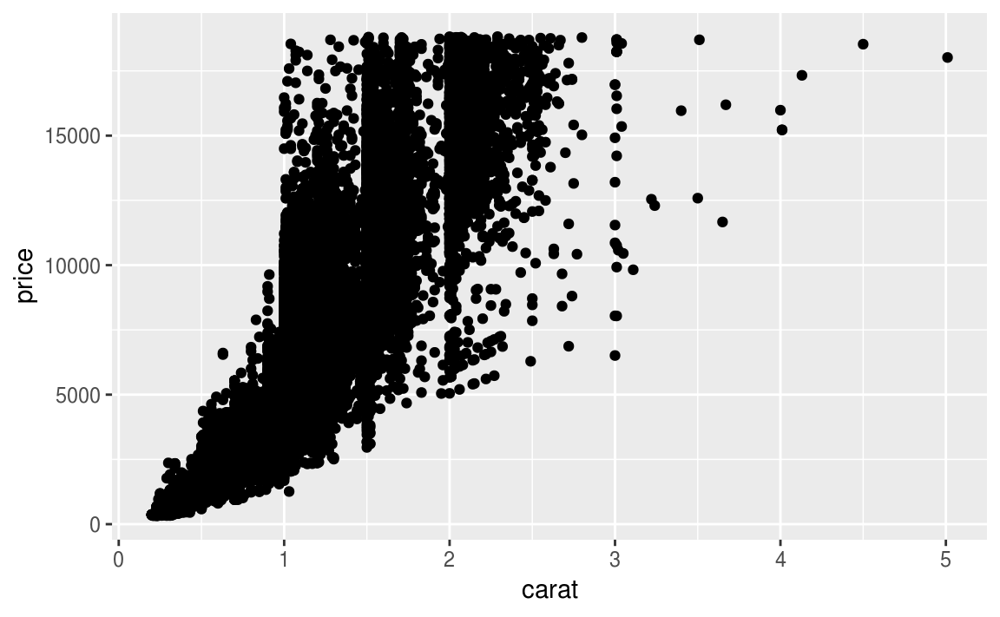
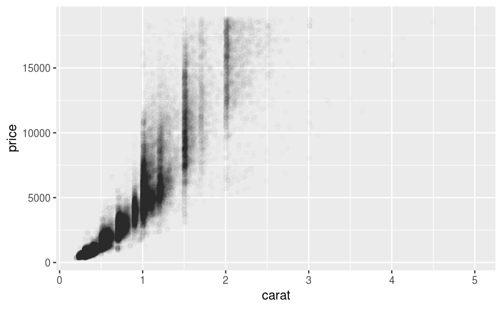
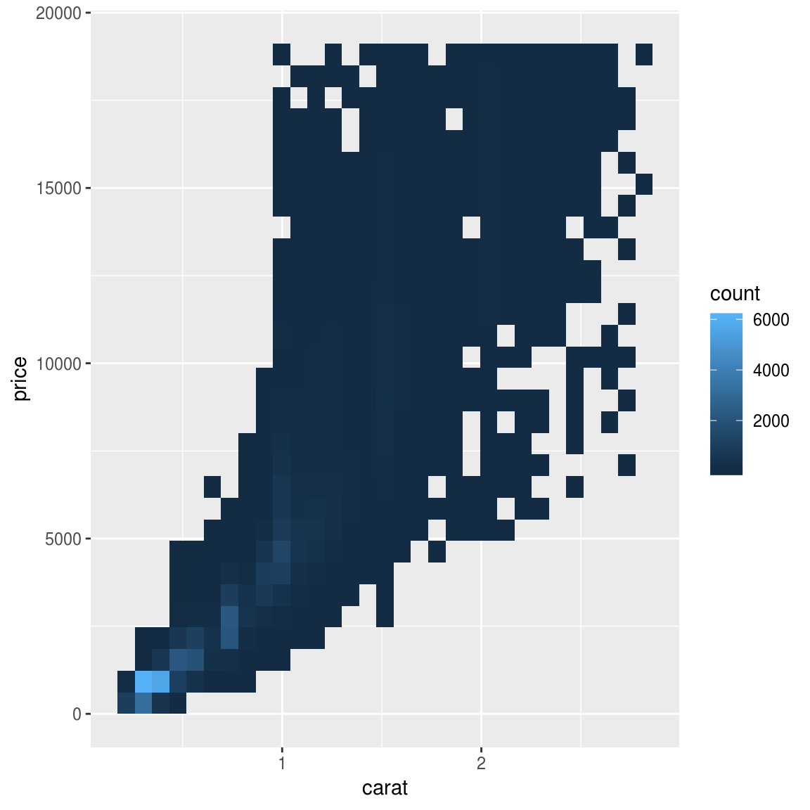
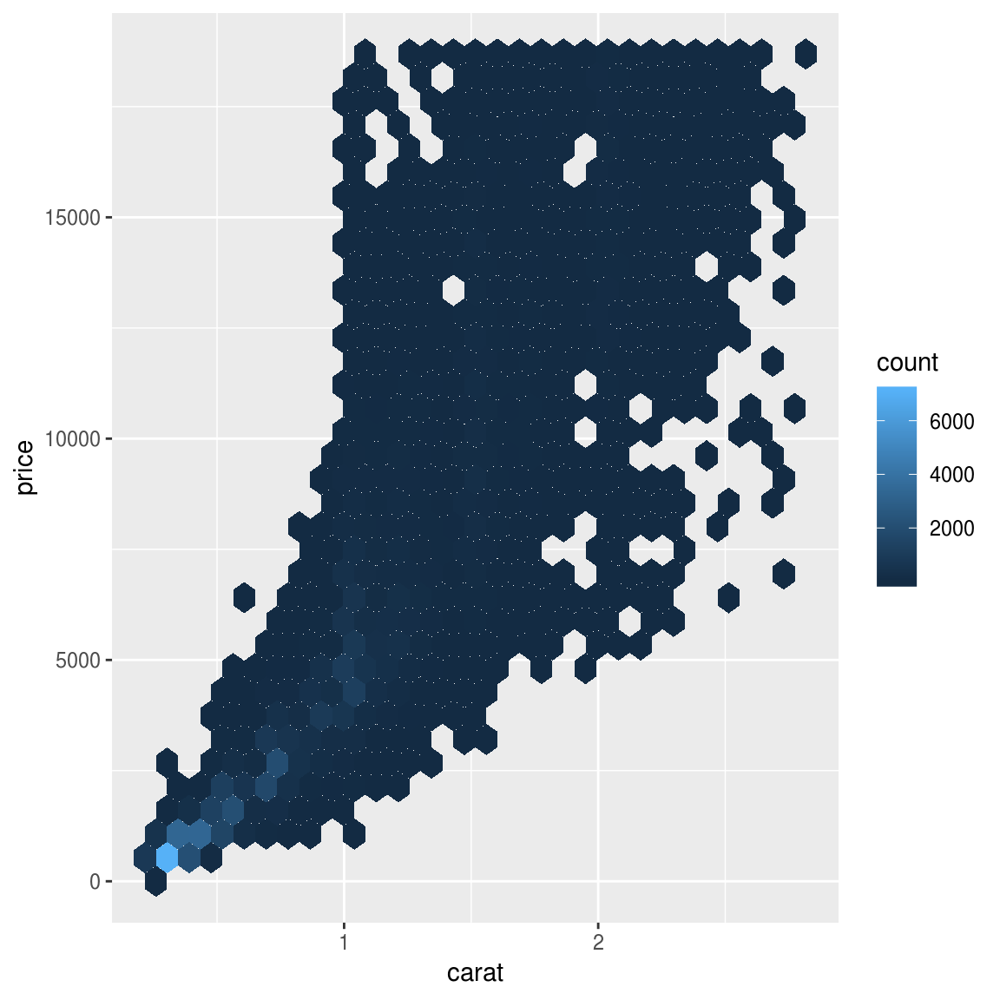

{::options parse_block_html="true" /}

<section>
# {{page.title}}

{{page.author}}

<small></small>

<small>*{{page.date}}*</small>

</section>

<section>
# Overview
* Exploratory Data Analysis (EDA)
* Techniques for 1-, 2-, multi-, high-dimensional data
</section>

<section>
# Exploratory Data Analysis
*"Far better an approximate answer to the right question, which is often vague, than an exact answer to the wrong question, which can always be made precise." -- John Tukey*

**Iterative cycle:**
{: .element: class="fragment" }
1. **Generate questions** about your data
1. **Search for answers** by visualising, transforming, and modelling your data
1. Use what you learn to **refine** your questions and/or generate new questions
{: .element: class="fragment" }

[**Source:** Hadley Wickham's [book chapter on EDA](http://r4ds.had.co.nz/exploratory-data-analysis.html) (2017)]

</section>
{: .small }

<section>
# Aspects of EDA
* **Variation**: tendency of the values of a variable to change from measurement to measurement
  - {: .element: class="fragment" } Study: distribution, typical values, unusual values, missing
* {: .element: class="fragment" } **Covariation**: tendency for values of two or more variables to vary together in a related way
  - Compare: A categorical and a continuous variable
</section>

<section data-transition="fade-in">
# One vs Two variables
{: title="[Wickham 2017, Ch. 7]" height="400px" }

Data: 272 eruptions of the Old Faithful Geyser in Yellowstone National Park
{: .tiny }
</section>

<section data-transition="fade-in">
# One vs Two variables
{: title="[Wickham 2017, Ch. 7]" height="400px" }

Data: 272 eruptions of the Old Faithful Geyser in Yellowstone National Park
{: .tiny }
</section>

<section>
# Boxplots
{: title="[Wickham 2017, Ch. 7]" }
</section>

<section>
# Boxplot comparison
{: title="[Wickham 2017, Ch. 7]" height="500px" text-align="center" }
</section>

<section data-transition="fade-in">
# Two categorical variables
{: title="[Wickham 2017, Ch. 7]" height="500px" text-align="center" }
</section>

<section data-transition="fade-in slide-out">
# Two categorical variables
{: title="[Wickham 2017, Ch. 7]" height="500px" text-align="center" }
</section>

<section data-transition="fade-in">
# Two continuous variables
{: title="[Wickham 2017, Ch. 7]" height="500px" text-align="center" }
</section>

<section data-transition="fade-in">
# Two continuous variables
{: title="[Wickham 2017, Ch. 7]" height="500px" text-align="center" }
</section>

<section data-transition="fade-in slide-out">
# Two continuous variables

{: title="[Wickham 2017, Ch. 7]" height="500px" { text-align="center" }

{: title="[Wickham 2017, Ch. 7]" height="500px" { text-align="center" }

</section>

<section>
# EDA in Python
* Dipanjan Sarkar's [practical ML in Python](https://github.com/dipanjanS/practical-machine-learning-with-python)
* Visit: [Workbook on Google collab](https://colab.research.google.com/drive/1y2M3uUcg-HHh8Blcj3XADMuv1EV-bFt3) with [blog post](https://towardsdatascience.com/the-art-of-effective-visualization-of-multi-dimensional-data-6c7202990c57)
</section>

<section>
# High-dimensional data
**Dimensionality reduction**
* Principle Component Analysis (PCA)
  - [Quantopian lecture](https://www.quantopian.com/lectures/principal-component-analysis)
* [t-SNE (t-distributed Stochastic Neighbor Embedding](http://www.jmlr.org/papers/volume9/vandermaaten08a/vandermaaten08a.pdf)
  - [Algorithm details [Maaten/Hinton]](https://docs.google.com/presentation/d/1uOWkXVdEL_P9kO-kCmjkeLdVGR-oYb-3_mLlXp0Ezs8)
  - [How to use effectively [Wattenberg]](https://distill.pub/2016/misread-tsne/)
* Force-directed layouts (later lecture)
</section>

