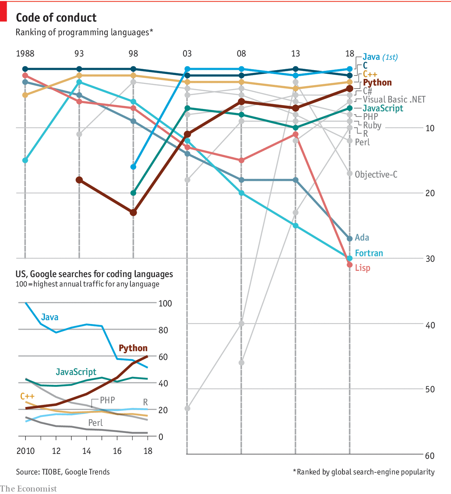

{::options parse_block_html="true" /}

<section>
# {{page.title}}

{{page.author}}

<small></small>

<small>*{{page.date}}*</small>

</section>

<section>
# Goal

* Explore data processing options in Python
* Compare a few visualization modules
  - Jupyter Notebook / Lab
  - Matplotlib
  - IPyWidgets
  - Plotly / Dash
</section>

<section>
# Programming in Data Science

* Hadley Wickham: "[Can't do data science in a GUI](https://speakerdeck.com/hadley/you-cant-do-data-science-in-a-gui)"
* Programming languages are Languages ([%>%](https://stackoverflow.com/a/24536653/5666312))
* Stored as Text
 - Copy & Paste
 - Provenance: Reproducible, Readable, Diffable, Open
</section>

<section>
# Why Python?

[{: height="300px"}](img/20180728_WOC883_langcomp.png)

* [World's most popular coding language](https://www.economist.com/graphic-detail/2018/07/26/python-is-becoming-the-worlds-most-popular-coding-language)
* [HN Language comparison](https://www.hntrends.com/2018/jun-no-signs-of-slowing-for-react.html)
</section>

<section>
# Python Vis Landscape

[{: height="300px"}](img/landscape-colors.png)

* Jake VanderPlas' [presentation](https://www.youtube.com/watch?v=FytuB8nFHPQ)
</section>

<section>
# Jupyter

* Consider Jupyter **Notebook** and **Lab**
```
jupyter lab --no-browser --port=8889
```
</section>

<section>
# IPyWidgets / Jupyter Widgets

* [Jupyter Dashboard Layouts](https://jupyter-dashboards-layout.readthedocs.io/en/latest/using.html)
* [IPyWidgets Documentation](https://ipywidgets.readthedocs.io)
</section>

<section>
# QGrid

* View, Filter, and Edit large DataFrames
* [Quantopian/QGrid](https://github.com/quantopian/qgrid)
* [Introduction](https://www.youtube.com/watch?v=AsJJpgwIX0)
* [Other Quantopian Intros](https://www.quantopian.com/lectures)
</section>

<section>
# Data for Experimentation

* [Global Landslide Catalog Export](https://data.nasa.gov/Earth-Science/Global-Landslide-Catalog-Export/dd9e-wu2v)
* See Kirschbaum et al. for analysis example:
  - [Landslide Catalog: Method and Results](https://link.springer.com/article/10.1007/s11069-009-9401-4)
  - [Presentation on susceptible areas](https://science.gsfc.nasa.gov/610/applied-sciences/disasters_wg_materials/216Dec20Kirschbaumlandslides.pdf)
* Combine with elevation information ([code](code))
</section>

<section>
# Visualize This! Challenge

* [Westgrid Visualization Challenge](https://westgrid.github.io/visualizeThis/journal/welcome-to-challenge.html)
* Register by Oct 1<sup>st</sup> to participate
</section>

<style>
.reveal h1 { font-size: 2.5em; }
</style>
